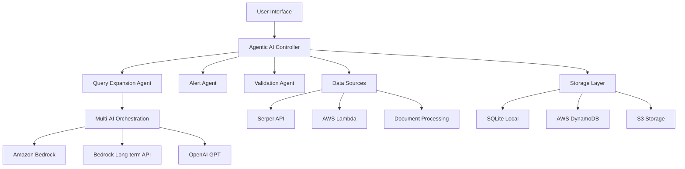

# 🚀 INSYT - Intelligent Network for Strategic Yield & Tracking

[](https://python.org)
[](https://streamlit.io)
[](https://aws.amazon.com)
[](https://openai.com)

Enhanced with AI-Powered Business Intelligence & Persistent Data Management

## 🌟 Overview

INSYT is an advanced business intelligence platform that leverages cutting-edge Agentic AI technologies to provide comprehensive company analysis, real-time monitoring, and data validation. The platform integrates multiple AI providers with intelligent fallback mechanisms and persistent storage capabilities.

## 🧠 Agentic AI Features

### 1. **Intelligent Query Expansion Agent**
- **Purpose**: Automatically enhances user queries with contextual business intelligence
- **Technology**: GPT-4 powered semantic analysis
- **Capabilities**:
  - Detects company names and industries from natural language
  - Expands simple queries into comprehensive research frameworks
  - Generates targeted research areas, key metrics, and competitive analysis points
  - Provides industry-specific context and risk assessment areas

**Example**: 
- Input: "Tesla analysis"
- Expanded: "Tesla comprehensive business analysis including financial performance, electric vehicle market position, competitive landscape against Ford/GM, battery technology developments, regulatory environment, supply chain challenges, and future growth projections"

### 2. **Real-Time Alert Agent**
- **Purpose**: Autonomous monitoring and alerting for business developments
- **Technology**: Multi-source monitoring with NLP analysis
- **Capabilities**:
  - Continuous monitoring of news, financial reports, and market developments
  - Keyword-based filtering with semantic understanding
  - Configurable alert frequencies (real-time, hourly, daily, weekly)
  - Automated alert triggering based on predefined criteria
  - Historical alert tracking and management

**Alert Types**:
- Earnings announcements
- Merger & acquisition activities
- Leadership changes
- Regulatory developments
- Product launches
- Financial distress indicators

### 3. **Data Validation Agent**
- **Purpose**: Cross-reference and validate information across multiple sources
- **Technology**: Multi-source verification with confidence scoring
- **Capabilities**:
  - Automated fact-checking across web sources
  - Confidence scoring based on source reliability
  - Discrepancy detection and reporting
  - Source credibility assessment
  - Historical validation tracking

**Validation Process**:
1. Extract key data points from analysis
2. Generate verification queries for each data point
3. Cross-reference across multiple sources
4. Calculate confidence scores
5. Identify and report discrepancies
6. Store validation history for trend analysis

### 4. **Multi-AI Orchestration System**
- **Purpose**: Intelligent routing and fallback across AI providers
- **Technology**: Hierarchical AI provider management
- **Architecture**:
  - **Primary**: Amazon Bedrock (Claude models)
  - **Secondary**: Bedrock Long-term API
  - **Fallback**: OpenAI GPT models
  - **Emergency**: Local processing capabilities

### 5. **Persistent Learning & Caching**
- **Purpose**: Intelligent storage and retrieval of analysis results
- **Technology**: SQLite + DynamoDB hybrid storage
- **Features**:
  - Smart cache management with expiration policies
  - Session-based data persistence
  - Historical analysis tracking
  - Performance optimization through intelligent caching

## 🏗️ Architecture



## 🚀 Key Features

| Feature | Description | Technology |
|---------|-------------|------------|
| 🧠 **Intelligent Query Expansion** | AI-powered query enhancement with contextual analysis | GPT-4, NLP |
| 🚨 **Real-Time Alerts** | Automated monitoring for market developments | Serper API, NLP |
| 🔍 **Multi-Source Validation** | Cross-reference data with confidence scoring | Multi-API verification |
| 💾 **Persistent Storage** | Intelligent caching with SQLite & DynamoDB | Hybrid database |
| 🤖 **Multi-AI Integration** | Bedrock, OpenAI & custom API fallbacks | Multi-provider |
| 📊 **Advanced Analytics** | Comprehensive business intelligence reports | Data aggregation |
| 📱 **Document Processing** | AI-powered PDF, Word & image analysis | OCR, NLP |
| ⚡ **Lambda Processing** | Serverless data aggregation & processing | AWS Lambda |
| 🔄 **Smart Caching** | Intelligent cache management & optimization | Custom algorithms |
| 📈 **Export & Share** | Professional reports in PDF, Word & Markdown | Multi-format |

## 📋 Prerequisites

- Python 3.8+
- AWS Account with Bedrock access
- OpenAI API key
- Serper API key (optional)
- Required Python packages (see requirements.txt)

## 🛠️ Installation

1. **Clone the repository**
```bash
git clone https://github.com/your-org/insyt-platform.git
cd insyt-platform
```

2. **Install dependencies**
```bash
pip install -r requirements.txt
```

3. **Set up environment variables**
```bash
cp .env.example .env
# Edit .env with your API keys and AWS credentials
```

4. **Run the application**
```bash
streamlit run app7_fixed.py
```

## 🔧 Configuration

### Environment Variables

```env
# AWS Configuration
AWS_ACCESS_KEY_ID=your_aws_access_key
AWS_SECRET_ACCESS_KEY=your_aws_secret_key
AWS_REGION=us-east-1

# AI Provider APIs
OPENAI_API_KEY=your_openai_api_key
SERPER_API_KEY=your_serper_api_key
TWITTER_BEARER_TOKEN=your_twitter_token

# Bedrock Long-term API
BEDROCK_LONGTERM_API_KEY=your_bedrock_longterm_key
BEDROCK_LONGTERM_API_ENDPOINT=https://bedrock-runtime.us-east-1.amazonaws.com
```

### AWS Services Required

- **Amazon Bedrock**: Primary AI provider
- **AWS Lambda**: Serverless processing
- **DynamoDB**: NoSQL database for scalable storage
- **S3**: File storage and sharing
- **IAM**: Access management

## 📊 Usage Examples

### Basic Company Analysis
```python
# Simple query expansion
result = assistant.search_company_info(
    "Microsoft", 
    search_mode="Extended Search",
    enable_agents=True
)
```

### Setting Up Alerts
```python
# Real-time monitoring
alert_agent.setup_alert(
    company_name="Tesla",
    alert_types=["earnings", "merger", "new product"],
    frequency="daily"
)
```

### Document Processing
```python
# Upload and analyze documents
content = assistant.process_attachment(uploaded_file)
analysis = assistant.search_company_info(
    "Analyze this document", 
    context=content
)
```

## 🔒 Security & Privacy

- **Data Encryption**: All data encrypted in transit and at rest
- **API Security**: Secure API key management
- **Access Control**: IAM-based permissions
- **Data Retention**: Configurable retention policies
- **Audit Logging**: Comprehensive activity tracking

## 🏭 Production Deployment

See [Production Guide](docs/production.md) for detailed deployment instructions.

## 🤝 Contributing

1. Fork the repository
2. Create a feature branch (`git checkout -b feature/amazing-feature`)
3. Commit your changes (`git commit -m 'Add amazing feature'`)
4. Push to the branch (`git push origin feature/amazing-feature`)
5. Open a Pull Request

## 📝 License

This project is licensed under the MIT License - see the [LICENSE](LICENSE) file for details.

## 🆘 Support

- **Documentation**: [docs/](docs/)
- **Issues**: [GitHub Issues](https://github.com/your-org/insyt-platform/issues)
- **Discussions**: [GitHub Discussions](https://github.com/your-org/insyt-platform/discussions)

## 🙏 Acknowledgments

- Amazon Web Services for Bedrock AI services
- OpenAI for GPT models
- Streamlit for the amazing web framework
- All contributors and the open-source community

---

**Built with ❤️ by the INSYT Team**
